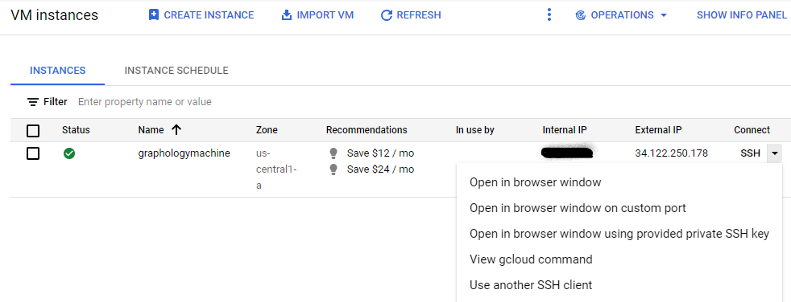
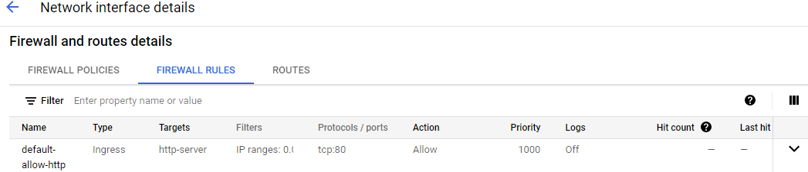
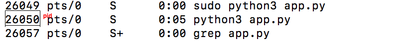

# Graphalogy App
### Initial Setup
1. Create a free-tier VM instance from the GCP compute engine console
2. Configure gcloud setup by following [these instructions](https://cloud.google.com/deployment-manager/docs/step-by-step-guide/installation-and-setup)
3. SSH into our pod by using the gcloud command available in the console in the VM instances page.
    <p align="center">
    
    </p>
4. Make sure the port 80 is open for HTTP, TCP protocol.
   <p align="center">
    
    </p>
5. Install flask, and other dependencies required to run our inferencing scripts
6. Clone Graphalogy repository
7. To start the server. Change directory to our repository and run `sudo python3 app.py &`

### Changes Deployment  
1. Pushing the commits from local system to our main branch.  
2. SSH into our pod by using the gcloud command available in the console.
3. Now cd to our repo and do a `git pull`
4. Now we will have to kill the current server process and restart so that the new changes reflect in the production.
   ```
   ps -ax | grep app.py
   #now note down the pid of our process and enter the following
   #command with our pid in it
   sudo kill -9 <pid>
   ```
    <p align="center">
    
    </p>
5. Now run, `sudo python3 app.py &`